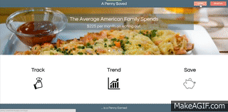

# PennySaved

Group Project, Members:
  Maike Fillmer,
  Greg Gallant,
  Aaron Karlsruher,
  James (Min) Kim

A Penny$aved is our week 16 project for Rutger's BootCamp.  It is an expense tracker for dining out.  It uses several technologies including:

Sequelize, MYSQL, Javascript, Node, JQuery, JQuery UI, Express, 

## About

A Penny Saved is a money spending visualization tool. Users input their eating out costs and this app will display their spending data vs all other user's data, showing them how much money they are truely spending on ote eating at thome. 

## Technologies Used:

MySQL, Javascript, NodeJS, JQuery, Express, Handlebars, PassportJS, bcrypt

## Link:

[Penny Saved](http://penny-saved.herokuapp.com/)

## Overview

1. Login to the app either through facebook or by signing up locally.
2. This will take you to your dashboard, to view you data. 
3. You can add meal entries on the left hand side. 

